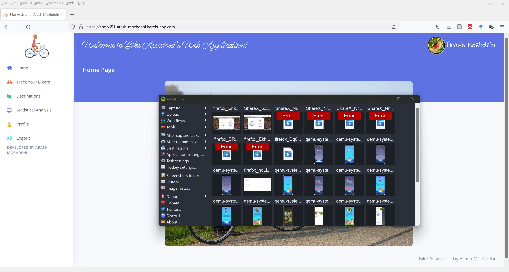
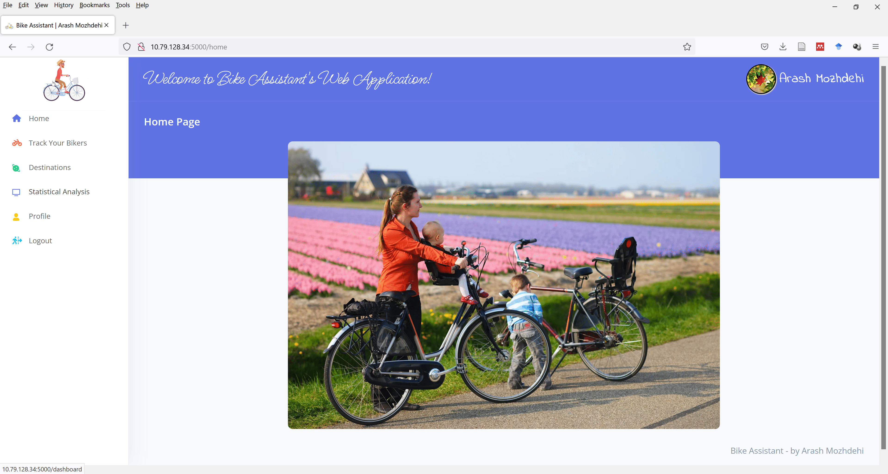

# Bike Assistant – RESTful API Backend and Web Application :bicyclist: :biking_woman:

## Table of Contents
- [Introduction](#introduction)
- [UML Architectural Design](#uml-architectural-design)
- [UML Sequence Diagram](#uml-sequence-diagram)
- [Architectural Description](#architectural-description)
- [Functionalities](#functionalities)
- [API Documentation](#api-documentation)
- [Supplementary Information](#supplementary-information)
- [Project Requirements](#project-requirements)
- [Project Launch](#project-launch)

## Introduction
The “Bike Assistant” project provides a one-stop service for cyclists in Calgary by providing a more convenient, safer, and fun cycling experience. In fact, this User-Friendly software suite allows the user to conveniently take advantage of the city of the Calgary’s cycling infrastructure and amusement places to spend quality free time. It also allows the users to conveniently find the parking lots for bikes near their workplace or other destinations, such as shopping centers or grocery stores. Users can also keep track of their exercise habit by providing them with the information about the estimated Calories they burnt, how much time they spent cycling and the distance they traveled. To allow the parent to keep their children safe, this software suite allows the parents to be aware of the current location, the destination, the estimate time and distance to the destination, of their children, using a user-friendly Web Application.\

“Bike Assistant” is a full-stack software suite consisting of RESTful Web API endpoint, a Relational Database, a NoSQL Database, a User-Friendly Mobile Application, as well as a User-Friendly Web-Based User Interface. As a powerful software suite merits a fine documentation and tutorial, we used different platforms, GitBook, Swagger, and GitHub’s readme, for the documentation. In this software suite we took advantage advances in **Artificial Intelligence (AI)** and used a **Machine Learning (ML)** algorithm, **Q-Learning**, to improve the user’s experience by providing them with most suited amenities based on their location by performing historical and contextual data analysis. For simplification and noise reduction and smoothing of trajectories, we used **Douglas–Peucker** algorithm and **Kalman filtering** technique.

Please visit the other repository [Mobile Application for Bike Assistant](https://github.com/ArashMozhdehi/ENGO-651-Final-Project-Mobile-UI) for the files and descriptions of the Mobile Application. 

## UML Architectural Design
The Figure 1 illustrates the archetectural design sigram of this Software Suite.
<p align="center" width="100%">
     
    <p align="center" > Figure 1: UML Diagram for Architectural Design</>
</p>
<!--  -->

## UML Sequence Diagram

In Figure 2, you can see the Sequence Diagram of the Web-based Application. For the Sequence Diagram of the Mobile Application

<p align="center" width="100%">
     
    <p align="center" > Figure 2: UML Sequence Diagram</>
</p>

## Architectural Description
The compentents of this sofeware suite are, as follows:
### 1. Databases
- PostgreSQL database with PostGIS host on Heroku cloud platform to store user’s activity. Figure 3, shows the UML Entity-Relation Diagram.
- **Firebase Real-Time DB**, a NoSQL database, host on Google cloud servers to store the user’s profile and credential. In Figure 4, the data storage model of this Real-Time DB is observable. We used Firebase Real-Time DB, for subscribing and real-time update upon data changes.
- **Firebase Storage** is used for staroage of user's profile images. The storage structure of Firebase Storage allows storing images in file structure instead of in BLOB/CLOB format.

<p align="center" width="100%">
     
    <p align="center" > Figure 3: UML Entity-Relation Diagram</>
</p>

<p align="center" width="100%">
     
    <p align="center" > Figure 4: Firebase Real-Time DB's storage model</>
</p>

<p align="center" width="100%">
     
    <p align="center" > Figure 5: Firebase Storage's storage model</>
</p>

### 2. Backend RESTful API
- Backend RESTful API powered by Flask library of Python.
- Consists of **17 API endpoints**, with over **1,000 lines of code** in Python high-level programming language, that each are explained in detail in GitBook.
- Token assignment is used for secure authorization and authentication when the API is used.
- To prevent **Dictionary, Rainbow, and impade Brute Force attacks**, we used an information security method of Salt concatination and Hasing using SHA256.
### 3. Web Application
- HTML, CSS and JS for asynchronous communication and interactive and responsive front-end.
- Web-UI consist of 12 html pages, 9 CSS stylesheet files. 8 .js script files in JavaScript with over **5,000 lines of code**. 
- It also consists of 18 routes and methods in Python.
- Material UI and Bootstrap 5 for aesthetic an interactive UI design.
- For the **Asynchronous** communication, to improve UX, we used jQuery with **AJAX** without SOAP protocol to take advantage of JSON format instead of XML.
### 4. Mobile Application
- It consist of 27 Java classes with over **15,00 lines of code**.
- It also consists of 27 layout designs with over **9000 lines of code** in XML.
- 
### 5. Others
- Google Map JS SDK for map visualization and a mapping frontend.
- Google Firebase SDK for retrival and storage.
- Google’s Matrix API, Google Place, Google Direction are the other APIs that are used in this web application.
- We used subscription based messagin protocol to keep track on users’ location, bearing, velocity, source, and destination of the Mobile Application users.
- We used **Machine Learning** for best amenity's recommendation.
- jQuery with AJAX without SOAP protocol is used for Async communication.
- For simplification and noise reduction and smoothing of trajectories, we used **Douglas–Peucker** algorithm and **Kalman filtering** technique.
- We used a fromula from "The Compendium of Physical Activities" for Calories burnt calculation.
- [Gitbook](https://arash-mozhdehi.gitbook.io/bike-assistant/) for comprehensive documentation of this project.
- [GitBook](https://arash-mozhdehi.gitbook.io/restful-apis-tutorial/) for API documentation with examples.
- [Swagger](https://app.swaggerhub.com/apis-docs/uofcengo/BikeAssistance/1.0.0) for API documentation with examples.


## Functionalities
### 1. Login

It is a responsive, secure and animated login page. User can login with the credntials that they entered upon registration and password. 

<!-- [](https://youtu.be/hdLZNZjTaoE) -->

<p align="center" width="100%">
     
</p>

### 2. Homepage

This aeasthtic dashboard allows access to the other pages.

<!--  -->
<p align="center" width="100%">
     
</p>

### 3. Logout

The user can logout of the system in two ways, conveinently, as shown in the GIFs.

<p align="center" width="100%">
     
</p>

<p align="center" width="100%">
     
</p>


### 4. Track Your Bikes
Through receiving the messages for the via MQTT broker it shows the Mobile user's current location. By sending the source, destination, current location of the cyclist, traveling speed, estimated time of arrival, and traveling distance using the Web-Based application parent and loved ones can keep track of the cyclists using MQTT protocol. It shows multiple biker because the application have the ability of multiple login.

<p align="center" width="100%">
     
</p>


<p align="center" width="100%">
     
</p>

### 5. Destinations
This pahe shows different types of destinations, histirocal sites, bike parks, parking lots for the bikes, and ongoing events in the city of Calgary in current day, adopted from Open Data Portal that suitable for cyclists, including the historical sites, city events, bike parks and bike parking lots. The mapping interface allows choosing different layers, different types of mapping views, for example, sattelite or tarrain. To make the interface beautiful, we used clustering method of pinpoints. Each one of the destinations is a pinpoint on the map. Each layer can be hided by toggling and un-toggling the checkboxes to left bottom. 

<p align="center" width="100%">
     
</p>

### 6. Statistical Analysis
Through animated, beautiful, informative, interactive, and easy to comprehend, Charts and illustrations it shows the the total distance, total traveling time of the current day and current week travelled by the cyclist, through histrical data analysis. They also compare the numbers for the last day and last week. The two charts from left to right illustrate the Calories burnt for the lst 10 days, and the distances traveled for the last 7 days. For simplification and noise reduction and smoothing of trajectories, we used Douglas–Peucker algorithm and Kalman filtering technique.

<p align="center" width="100%">
     
</p>

### 7. Profile

It shows the user profile, including username, first name, last name, email address, weight, number of the logged in devices, number of the reviews on different destinations submitted by the user, and the number of feedbacks for amenities that user submitted. It also allows user to make changes on the email, weight, password and share their info. The circular images show the user's profile image, restived from Firebase Storage. Through this interface the users are allowed to change their password, email address, weight, and their profile infor message to share their story.


<p align="center" width="100%">
     
</p>


## API Documentation
There are 17 API endpoints built for this project. Please click [here](https://app.swaggerhub.com/apis-docs/uofcengo/BikeAssistance/1.0.0) to see the details with example of each of the API. 

### 1. /api/signin: This endpoint allows the front-end to authenticate the user and returns a token that allows the user to access to his/her account in future. Upon successful signin this following message will be returned.

```
{
	"message": "success",
	"f_name": "Arash",
	"l_name": "Mozhdehi",
	"token": "cd1f0d7032aacfad6c61e04bc0e11a03"
}
```
Sent message format:
```
{
	"username": "amozhdehi",
	"password": "8c6976e5b5410415bde908bd4dee15dfb167a9c873fc4bb8a81f6f2ab448a918"
}
```

## Supplementary Information
- [Mobile Application Manual and Documentation]( https://arash-mozhdehi.gitbook.io/bike-assistant/v/mobile-application/)
- [Web-based Application Manual and Documentation](https://arash-mozhdehi.gitbook.io/bike-assistant/v/web-based-application/)
- [Database Documentation](https://arash-mozhdehi.gitbook.io/bike-assistant/)
- [GitBiik Space](https://arash-mozhdehi.gitbook.io/bike-assistant/)
- [API Documentation - GitBook](https://arash-mozhdehi.gitbook.io/restful-apis-tutorial/)
- [API Documentation - Swagger](https://app.swaggerhub.com/apis-docs/uofcengo/BikeAssistance/1.0.0)
- [Mobile UI GitHub Repo](https://github.com/ArashMozhdehi/ENGO-651-Final-Project-Mobile-UI)

## Achievements of API Regarding the Project Requirements
The API endpoint sets satisfy the following requirements for the ENGO 651 course project.

1. "your final project must be sufficiently distinct from the labs in this course, and must be more complex than the labs." : This API is complex and has 17 endpoint and uses complex algorithms such as Q-Learning for Data Analytic. (Requirement #1)
2. "must have a RESTful API back-end": The RESTful API back-end is powered by Flask library of python. (Requirement #3)
3. "RESTful API must have authentication": The token is generated through the performing hash on the concatenation of the user's credentials and a salt value, to allow multiple login. (Requirement #4)
4. "API must be documented in detail on GitHub with example uses": The API is documented thoroughly with examples using Gitbook, Swagger.io, and in GitHub. (Requirement #5)
5. "must use at least one open data": This batch of endpoint uses the following open data sources: (Requirement #6)
   * Open Calgary
     * Parking lot for the bikes
     * Historical sites
     * Ungoing events in the city of Calgary (It only pick the events that are not ended yet)
     * Calgary's historical sites
     * Calgary's benches
     * Calgary's wash rooms
     * Calgary's water fountains
     * Calgary's live traffic incidents
     * Calgary's construction sites
   * Google's APIs
     * Google Maps SDKs
     * Google Directions (For visualizing the bike-friendly route to the destination)
     * Google Distance Matrix (For measuring the distance between the current location of the user and the destination)
     * Google Geocoding (For finding the place based on the Zip Code)
     * Google Geolocation (User's current location)
     * Google Places (For auto-complete)
6. "must use at least one live data set": It uses the location data from the IoT devices to provide statistical analysis on the user's activity and behavior, how much Calories they burn within a specific time range. (Requirement #7)
7. "must perform data analytics using the following data sources": As mentioned in the previous bullet-point, it preforms statistical analysis on users' location provided by their phones(the historical data of the IoT device). These API's endpoint batches also perform analysis on the user's current location(the real-time data of an IoT devices), the data provided by the Open Calgary, e.g. toilets', water fountains', and benches' locations (the historical data) and search for the matches within a range(contextual geo-spatial data relevant to the data collected by the devices). In the next step using a Q-Learning-based algorithms tries to find the best toilet within the range using the users' feedbacks as reward.
8. "solve a problem": The purpose of this API endpoint batch is to provide convenience (choosing the convenient amenities based on the users feedback) and safety (by providing safety feedback from the other users) for the users. (Requirement #10)

## Project Launch
February 2022
